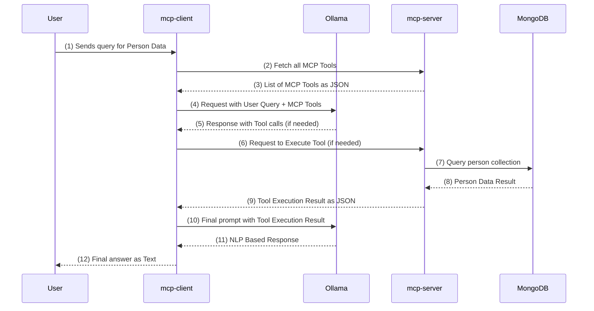

# spring-ai-mcp-mongo

A full-stack AI-powered query system using Spring Boot, MongoDB, and Ollama LLM. The system consists of two main components:

- **mcp-client**: REST API client for user queries. Interacts with both Ollama (for LLM responses) and mcp-server (for structured data queries).
- **mcp-server**: Provides tools (APIs) to find details related to people. Queries person data from MongoDB.
- **Ollama**: Local LLM server for natural language processing.
- **MongoDB**: Stores person data in a `person` collection.


### Sequence Diagram



#### Step-by-step Explanation

1. **User sends query for Person Data:**
   - The user initiates a request (e.g., "Find all people older than age 44") to the mcp-client API.
2. **Client fetches all MCP Tools:**
   - mcp-client requests the list of available tools (APIs) from mcp-server that can be used to answer the query.
3. **Server returns list of MCP Tools as JSON:**
   - mcp-server responds with a JSON list describing available tools and their capabilities.
4. **Client sends request with User Query + MCP Tools to LLM:**
   - mcp-client sends the user query and the list of tools to Ollama (LLM) for reasoning and planning.
5. **LLM responds with Tool calls (if needed):**
   - Ollama analyzes the query and tools, and may respond with instructions to call a specific tool (API) on mcp-server.
6. **Client requests Server to Execute Tool (if needed):**
   - mcp-client sends a request to mcp-server to execute the required tool (e.g., findPeopleOlderThan(age=44)).
7. **Server queries person collection in DB:**
   - mcp-server queries the MongoDB person collection to fetch the relevant data.
8. **DB returns Person Data Result:**
   - MongoDB returns the query result to mcp-server.
9. **Server returns Tool Execution Result as JSON:**
   - mcp-server sends the tool execution result back to mcp-client.
10. **Client sends final prompt with Tool Execution Result to LLM:**
    - mcp-client sends the tool result and original query to Ollama for final natural language response generation.
11. **LLM returns NLP Based Response:**
    - Ollama generates a user-friendly, natural language answer based on the data and returns it to mcp-client.
12. **Client returns final answer as Text to User:**
    - mcp-client sends the final answer back to the user.

## MongoDB Schema (Person)
MongoDB has a single collection named `person` that stores details about persons.
Each document in the `person` collection has the following structure:

```json
{
  "_id": "ObjectId",
  "firstName": "string",
  "middleName": "string",
  "lastName": "string",
  "age": "int",
  "street": "string",
  "city": "string",
  "state": "string",
  "zipCode": "string"
}
```

## Development

### Prerequisites
- Java 17+
- Docker & Docker Compose
- Maven

### Build Project

```sh
./mvnw clean install
```

### Run Project
- Run MongoDB and Ollama using Docker Compose.
```sh
docker compose up -d
```
> Ollama downloads models on first run, so it may take some time. Next time it will be faster as it uses volumes to cache models.

- Run mcp-server app <br/>
  <small>Run mcp-server via IDE or command line.</small>
```sh
./mvnw spring-boot:run -pl mcp-server
```
- Run mcp-client  app  <br/>
  <small>Run mcp-client via IDE or command line.</small>
```sh
./mvnw spring-boot:run -pl mcp-client
```

### Build and Run (All Services in Docker)
```sh
./mvnw clean install && docker compose --profile client-server up -d --build
```
> This builds the project and starts MongoDB, Ollama, mcp-client, and mcp-server in Docker containers. It also exposes ports 8080 (mcp-server) and 8082 (mcp-client) so that you can access them via localhost.

## Execute mcp-server Tools (Optional)
You can use the Model Context Protocol Inspector to manually execute mcp-server tools.
```sh
npx @modelcontextprotocol/inspector java -jar  mcp-server/target/mcp-server-1.0.0.jar 
```

## Examples
Send a query to the client API:
```sh
curl --location 'http://localhost:8082/query' \
--header 'Content-Type: application/json; charset=UTF-8' \
--header 'Accept: */*' \
--data '{
    "query": "Find all people older than age 44"
}'
```

**Sample Response:**

```
{
    "response": Here are the people who are older than 44 years old that I found:

* Andrew U Lewis, age 45, living at 999 Hickory Ln, Dallas, TX, zip code 75202.
* Henry K Ward, age 45, living at 5100 Linden Ave, Fort Worth, TX, zip code 76106.
}
```

## License
[Apache License 2.0](LICENSE)
